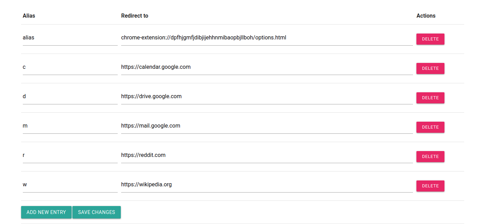

# URL Alias


A fork from [karan's URL Alias chrome extension](https://github.com/karan/chrome-url-alias) that uses webRequest to intercept outgoing requests and redirect to the desired webpage, thus preventing Chrome showing "this site can't be reached" before redirecting.

### Example:



## Features

#### Static aliases

```
*m* (Alias) -> *https://mail.google.com* (Redirect)
```

#### Dynamic aliases
You can use `###` as a placeholder and anything matching that pattern will be replaced.

Example:
```
*r/###* (Alias) -> *http://reddit.com/r/###* (Redirect)
```
You can also combine dynamic and static aliases.

Example:
```
*r* (Alias) -> *http://reddit.com* (Redirect)

*r/###* (Alias) -> *http://reddit.com/r/###* (Redirect)
```
## License

Apache 2.0
